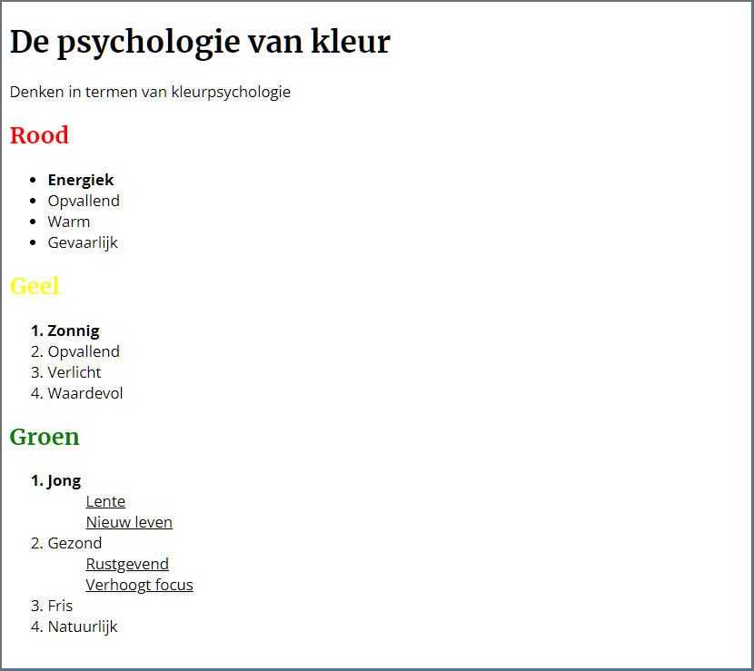
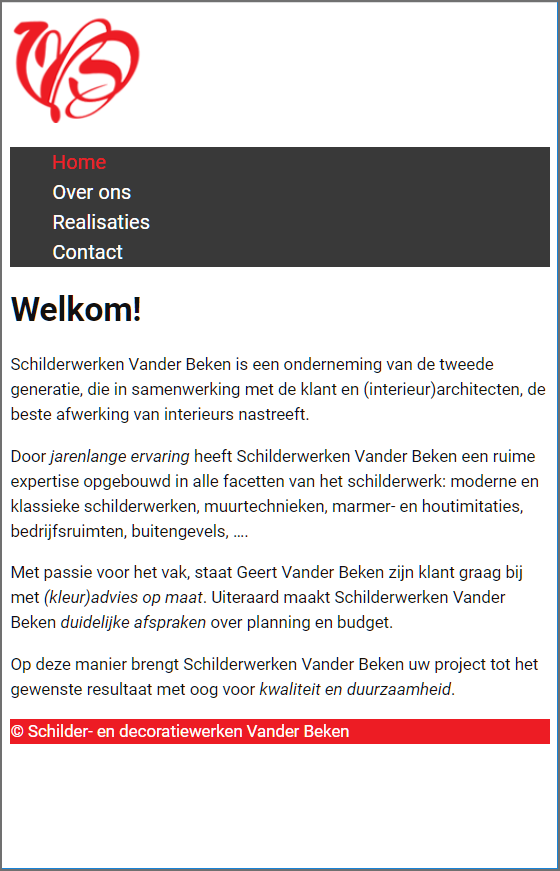
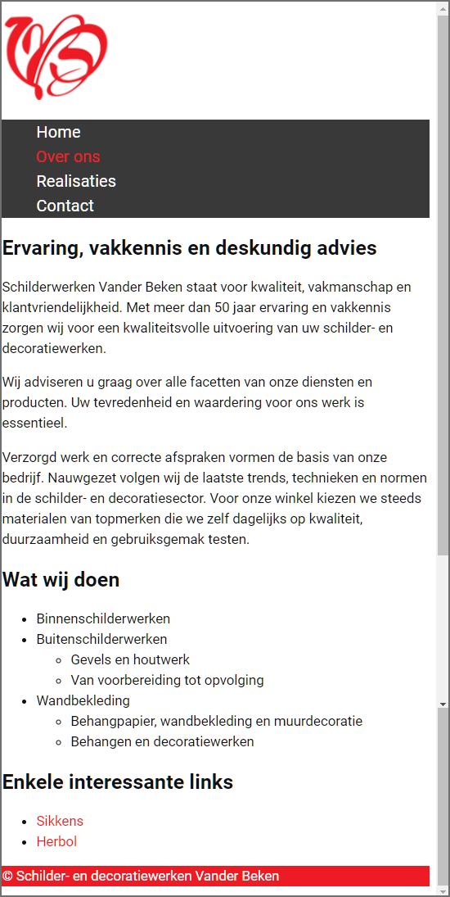
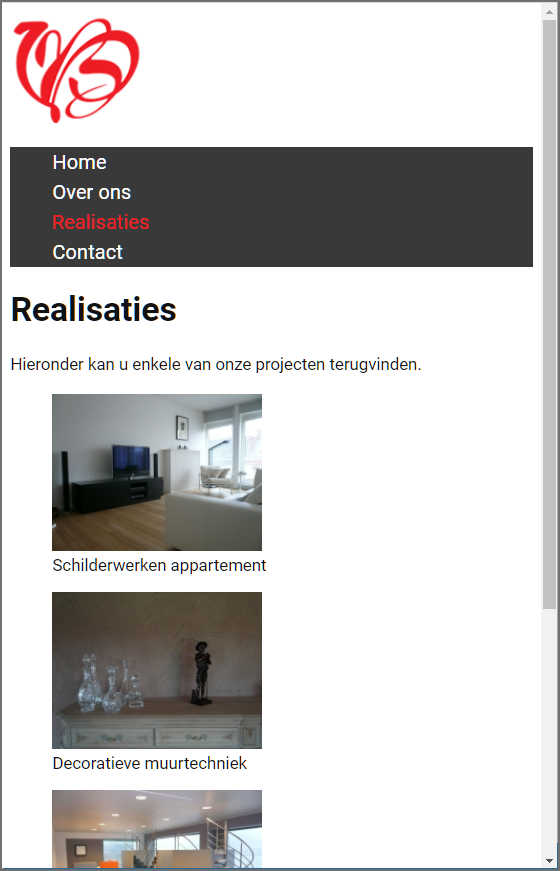
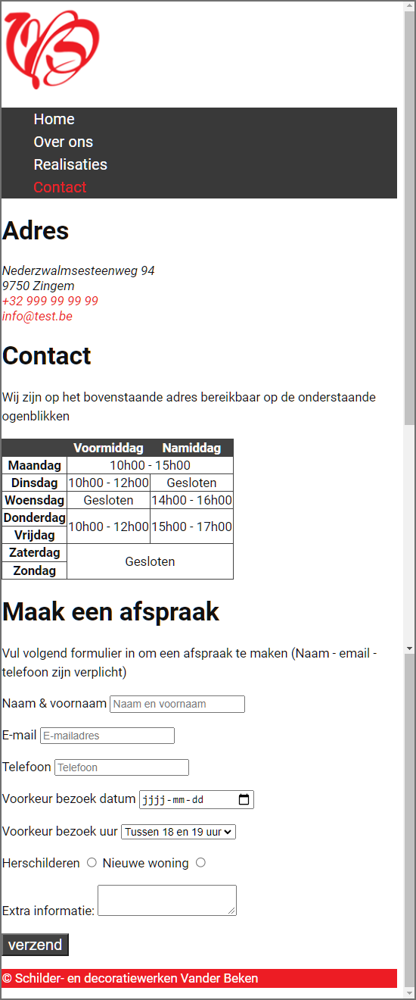
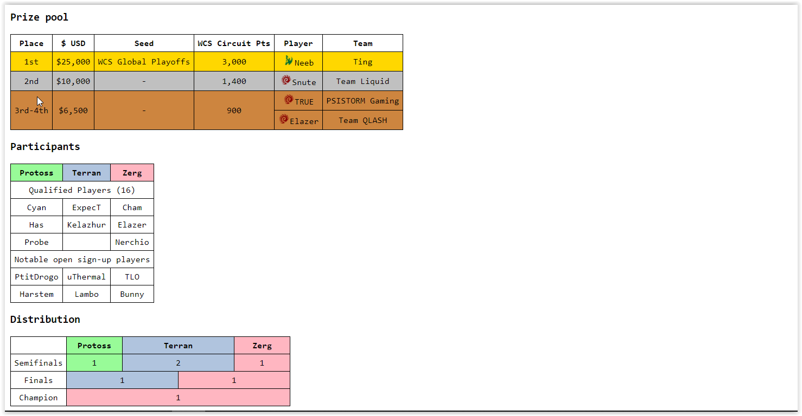

# Oefeningen les 5: CSS Basis deel 2


## Oefening 1: Cascading - Inheritance

Beschouw onderstaande webpagina. Bepaal voor het **p**-element de waarde (computed value) voor elk van de onderstaande CSS properties. Doe dit zonder gebruik te maken van de Developers Tools en zonder de webpagina te openen. 

  - font-size
  - font-style
  - color
  - background-color

Als je de waarden bepaald hebt kan je jouw oplossing controleren door de webpagina te openen in Google Chrome en/of door gebruik te maken van de Chrome Developer Tools.

``` html
<!DOCTYPE html>
<html lang="en">
<head>
  <meta charset="UTF-8">
  <meta http-equiv="X-UA-Compatible" content="IE=edge">
  <meta name="viewport" content="width=device-width, initial-scale=1.0">
  <title>Specificity</title>
  <style>
    body {
      font-size: 1.5em;
    }

    body > p {
      background-color: red;
      font-style: italic;
    }

    p {
      background-color: green;
      color:orange;
    }

    h1 + p {
      color: white;
      font-style: normal;
    }
  </style>
</head>
<body>
  <h1>Specificity</h1>
  <p>What is my color, background-color and font-style? Am i italicized or not?.</p>
</body>
</html>
```
-----

## Oefening 2: Cascading - Inheritance

Open de map **oefening02-cascading-inheritance**. De opgave staat in **style.css**.           
         

-----


## Oefening 3: Specifications Table

Voeg aan **oefening03-table** een stijl toe zodat de elementen met `class="spec-living"` een rode kleur krijgen. Zonder `!important`  te gebruiken. Het gebruik van `!important` is immers 'bad practice'. Gebruik het enkel om CSS van externe libraries te overschrijven.

Te bekomen eindresultaat:

     


-----


## Oefening 4: Kleuren

Open de map **oefening04-kleuren**. Maak een map **css** aan en ook een **main.css** in deze map.      
Leg in **index.html** de link naar deze externe stylesheet.    

Voeg stijlregels toe aan het css-bestand zodat je onderstaande webpagina bekomt. 

1. Gebruik het Google font "Merriweather" voor de headings en het Google font "Open Sans" voor de overige tekst. Voeg de google fonts toe via een `<link>`-element.
2. Gebruik pseudo-classes om de headings in rood, geel en groen weer te geven.
3. De lijsttekens bij de geneste lijsten worden niet weergegeven en alle tekst is onderlijnd.
4. Merk op dat bij elke kleur het eerste item bold wordt weergegeven, omdat dit het belangrijkste item is.
Normaal zouden we dus strong-elementen toevoegen aan deze items. Maak echter, bij wijze van oefening, gebruik van een class-selector om bij elke kleur het eerste item bold te maken.
4. Kan je de items ook bold maken zonder een class-selector te gebruiken? Let op: de eerste items in de geneste lijsten nl. 'Lente' en 'Rustgevend' mogen niet Bold worden weergegeven.

Te bekomen eindresultaat:

             
        

---

## Oefening 5: Vander beken - lettertypes en kleuren

Gebruik voor de vanderbeken-oefening het Google-lettertype **Roboto**. De vanderbeken-website  bevat gewone tekst, cursieve en vette tekst. Selecteer dus de styles 'Regular 400', 'Regular 400 italic'en 'Bold 700'. Voeg de fonts toe aan je website met behulp van een `@import` statement.

Bekijk de website in je browser en controleer met de Developer Tools of het lettertype Roboto geladen wordt.
  - Open de Developer Tools (F12).
  - Selecteer bij **Elements** een HTML-element met tekst.
  - Selecteer **Computed** en kijk welke de 'Rendered font' is.

Voeg kleur- en tekst-eigenschappen toe aan de vanderbeken-oefening. Welke kleur- en tekst-eigenschappen je moet toevoegen is beschreven in de css-file.

De meeste lay-out en witruimtes voegen we voorlopig nog niet toe aan de website. Dit komt later aan bod in de lessen.

Eindresultaat: 

**index.html**

          

**over_ons.html**

          

**realisaties.html**

          

**contact.html**

          


---

## Oefening 6: Likwiepedia.

Open de map **oefening06-likwiepedia**.
 
Voeg de stijlregels toe voor de opmaak van de tabellen zoals hieronder te zien is.

Je lost de oefening op zonder classes te gebruiken.

Volgende kleuren worden gebruikt:      
    - gold               
    - silver             
    - peru     
    - lightpink                
    - lightsteelblue             
    - palegreen              

EXTRA:  Maak ook de oefening eens gebruikmakend van classes.

Eindresultaat:      

     
